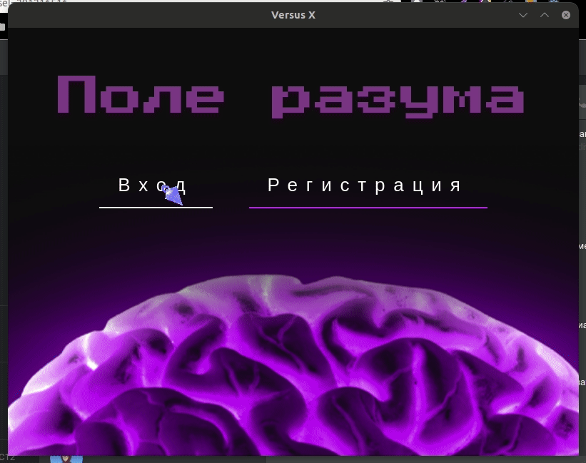

НАЗВАНИЕ: Поле разумов
Игра на подобии поля чудес

# Алгоритм отгадывания

1. Программа загадывает слово
2. Пользователи пытаются угадать буквы слова
   1. Спрашивают три буквы
   2. Для каждой буквы открываются все вхождения
   3. За каждые открытые 3 буквы слова даётся доп попытка
   Пример: КАТАМАРАН, \*\*\*\*\*\*\*\*\*, буквы У Н А, \*\А\*\А\*\А\*\А\Н, до попытка К, \К\А\*\А\*\А\*\А\Н
3. Можно назвать слово целиком, тогда победа сразу

# Фичи

* Выбор категории слов
* Регистрация
* Таблица лидеров (по отгаданным словам)
* Личные встречи, 1 на 1 (бесконечные игры, со счетом побед/поражений игроков)

# Полный алгоритм программы

1. Войти или зарегистрироваться
2. Выбрать категорию слов (кнопка "назад" для перевыбора категории)
2. Выбрать режим: 1 на 1, одиночная игра
3. РЕЖИМ: 1 на 1
   1. Один игрок создаёт игру
   2. Получает SID
   3. Делится с другим игроком
   4. Второй подключается по SID
   5. Когда оба подключились начинается игра
   6. Игроки выполняют ходы
   7. Определяется победитель раунда
   8. Изменяется счет побед/поражений
   9. Игра запускается по новой
   10. Есть возможность в любой момент _покинуть игру_
4. РЕЖИМ: одиночный
   1. У пользователя ограниченное количество ходов
   2. Кол-во ходов может возрастать за счет хорошего угадывания букв слова
   3. Данные о результате заносятся в БД, для генерации таблицы лидеров
5. Таблица лидеров
   1. Сравнивает пользователей по _среднему времени отгадывания слова_ в одиночном режиме,
      меньше = выше в рейтинге
      
# Игровой процесс
